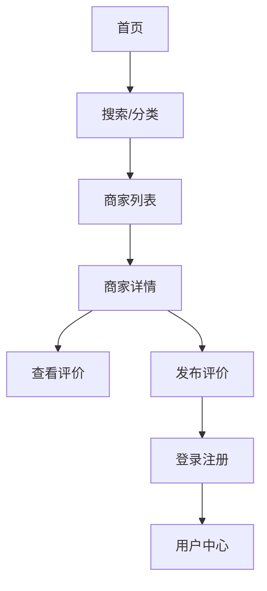

## 1. 产品概述
简化版大众点评网站，为用户提供本地商家信息浏览、评价和搜索服务。用户可以注册登录、查看商家信息、发布评价，帮助其他用户发现优质商家。

目标用户：需要寻找本地商家服务的消费者，以及希望获得用户反馈的商家。产品价值在于连接消费者与商家，通过真实评价提升消费决策质量。

## 2. 核心功能

### 2.1 用户角色
| 角色 | 注册方式 | 核心权限 |
|------|----------|----------|
| 普通用户 | 手机号+验证码或邮箱+密码注册 | 浏览商家、发布评价、管理个人资料 |
| 游客 | 无需注册 | 仅浏览商家信息和评价 |

### 2.2 功能模块
简化版大众点评包含以下核心页面：
1. **首页**：商家推荐、分类导航、搜索入口
2. **商家列表页**：商家卡片列表、筛选排序
3. **商家详情页**：商家信息、评价列表、发布评价
4. **用户中心**：个人资料、我的评价、账号设置
5. **登录注册页**：用户认证、账号创建

### 2.3 页面详情
| 页面名称 | 模块名称 | 功能描述 |
|-----------|-------------|-------------|
| 首页 | 搜索栏 | 输入关键词搜索商家名称和分类 |
| 首页 | 分类导航 | 点击分类图标浏览对应类型商家 |
| 首页 | 推荐商家 | 展示热门商家卡片，点击进入详情 |
| 商家列表页 | 商家卡片 | 显示商家名称、评分、地址、距离 |
| 商家列表页 | 筛选排序 | 按分类、距离、评分筛选排序 |
| 商家详情页 | 商家信息 | 展示名称、地址、电话、营业时间 |
| 商家详情页 | 地图定位 | 显示商家位置地图 |
| 商家详情页 | 评价列表 | 按时间倒序展示用户评价 |
| 商家详情页 | 发布评价 | 输入1-5星评分、文字评价、上传图片 |
| 用户中心 | 个人资料 | 编辑头像、昵称、联系方式 |
| 用户中心 | 我的评价 | 查看自己发布的评价历史 |
| 登录注册页 | 手机登录 | 输入手机号获取验证码登录 |
| 登录注册页 | 邮箱登录 | 输入邮箱密码登录 |
| 登录注册页 | 用户注册 | 创建新账号，验证手机号或邮箱 |

## 3. 核心流程

### 用户浏览流程
用户访问首页 → 搜索或选择分类 → 浏览商家列表 → 查看商家详情 → 阅读评价 → 注册登录后可发布评价

### 用户注册流程
点击登录 → 选择手机或邮箱注册 → 输入验证信息 → 完善个人资料 → 开始使用评价功能

## 4. 用户界面设计

### 4.1 设计风格
- **主色调**：橙色（#FF6B35）搭配白色背景，营造活力温暖的氛围
- **按钮样式**：圆角矩形设计，主要按钮使用渐变色，次要按钮使用边框样式
- **字体规范**：中文使用PingFang SC，英文使用SF Pro Display，正文字号14-16px
- **布局风格**：卡片式布局，顶部导航栏+底部标签栏的双导航结构
- **图标风格**：使用圆润的线性图标，保持视觉一致性

### 4.2 页面设计概览
| 页面名称 | 模块名称 | UI元素 |
|-----------|-------------|-------------|
| 首页 | 搜索栏 | 白色圆角输入框，橙色搜索按钮，占位符文字"搜索商家、分类" |
| 首页 | 分类图标 | 圆形彩色图标，4列网格布局，图标下方显示分类名称 |
| 商家卡片 | 商家信息 | 左侧图片140x100px，右侧显示名称、星级评分、地址、距离 |
| 商家详情 | 头部图片 | 全宽300x200px商家图片，覆盖半透明黑色渐变 |
| 商家详情 | 基本信息 | 白色卡片内显示，包含电话图标、地址图标、时钟图标 |
| 评价卡片 | 用户信息 | 圆形头像40x40px，右侧显示昵称、星级、评价时间 |
| 评价输入 | 评分组件 | 5颗灰色星星，点击变为橙色，支持半星评分 |
| 个人中心 | 头部背景 | 渐变色背景，白色圆形头像居中显示 |

### 4.3 响应式设计
采用移动优先的响应式设计，断点设置为：
- 移动端：< 768px，单列布局，底部导航
- 平板端：768px - 1024px，双列网格布局
- PC端：> 1024px，三列网格布局，侧边导航

所有交互元素最小点击区域为44x44px，确保移动端操作便利性。