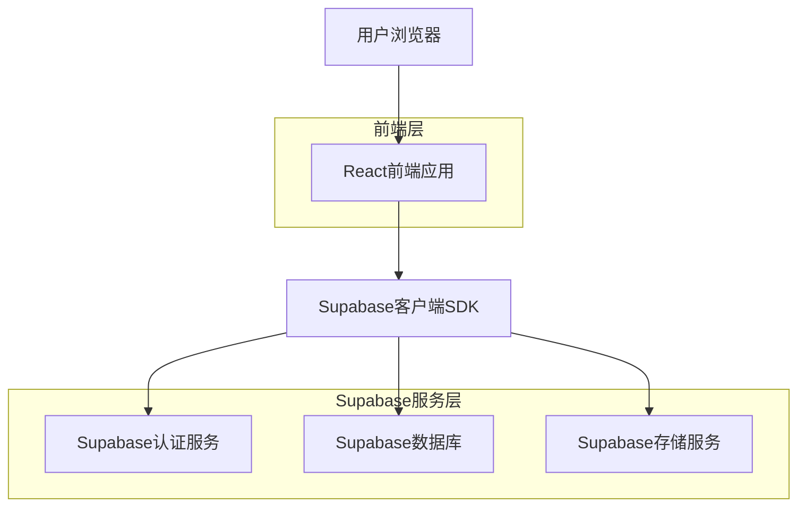
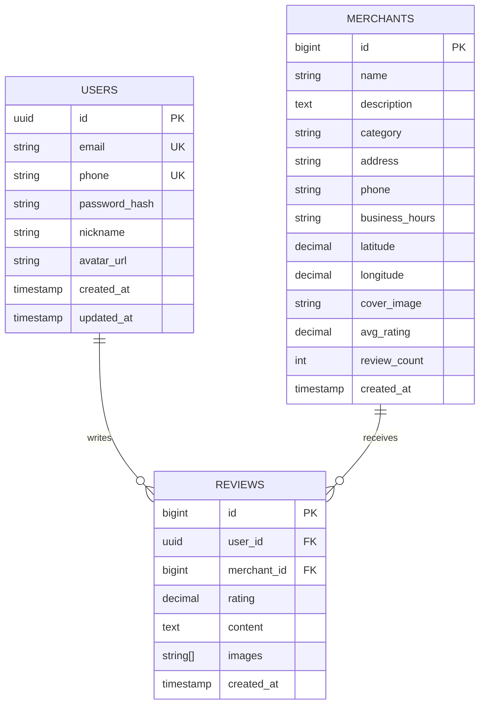

## 1. 架构设计



## 2. 技术描述

- **前端**: React@18 + TypeScript + TailwindCSS@3 + Vite
- **初始化工具**: vite-init
- **后端服务**: Supabase (集成认证、数据库、文件存储)
- **地图服务**: 腾讯地图API / 高德地图API
- **UI组件库**: HeadlessUI + Heroicons

## 3. 路由定义

| 路由 | 用途 |
|-------|---------|
| / | 首页，展示推荐商家和分类 |
| /search | 搜索结果页，显示商家列表 |
| /category/:id | 分类页，按分类展示商家 |
| /merchant/:id | 商家详情页，展示商家信息和评价 |
| /profile | 个人中心，用户资料管理 |
| /login | 登录页，支持手机验证码和邮箱登录 |
| /register | 注册页，创建新用户账号 |
| /reviews | 我的评价，查看用户发布的评价历史 |

## 4. API定义

### 4.1 认证相关API

**用户注册**
```
POST /auth/v1/signup
```

请求参数:
| 参数名 | 类型 | 必需 | 描述 |
|--------|------|------|------|
| email | string | 是 | 用户邮箱 |
| password | string | 是 | 用户密码 |
| phone | string | 否 | 手机号（备用） |

响应:
```json
{
  "user": {
    "id": "uuid",
    "email": "user@example.com",
    "created_at": "2024-01-01T00:00:00Z"
  },
  "session": {
    "access_token": "eyJhbGc...",
    "refresh_token": "eyJhbGc..."
  }
}
```

**用户登录**
```
POST /auth/v1/token?grant_type=password
```

**手机号登录**
```
POST /auth/v1/otp
```

### 4.2 商家相关API

**获取商家列表**
```
GET /rest/v1/merchants?select=*&order=created_at.desc
```

查询参数:
| 参数名 | 类型 | 描述 |
|--------|------|------|
| category_id | number | 分类ID筛选 |
| search | string | 关键词搜索 |
| lat | number | 用户纬度 |
| lng | number | 用户经度 |
| range | number | 搜索范围（公里） |

**获取商家详情**
```
GET /rest/v1/merchants?id=eq.{id}&select=*
```

### 4.3 评价相关API

**获取评价列表**
```
GET /rest/v1/reviews?merchant_id=eq.{id}&order=created_at.desc
```

**发布评价**
```
POST /rest/v1/reviews
```

请求体:
```json
{
  "merchant_id": 123,
  "rating": 4.5,
  "content": "味道很不错，服务态度也很好",
  "images": ["image1.jpg", "image2.jpg"]
}
```

## 5. 数据模型

### 5.1 实体关系图



### 5.2 数据定义语言

**用户表 (users)**
```sql
-- 创建用户表
CREATE TABLE users (
    id UUID PRIMARY KEY DEFAULT gen_random_uuid(),
    email VARCHAR(255) UNIQUE,
    phone VARCHAR(20) UNIQUE,
    password_hash VARCHAR(255) NOT NULL,
    nickname VARCHAR(50) NOT NULL,
    avatar_url TEXT,
    created_at TIMESTAMP WITH TIME ZONE DEFAULT NOW(),
    updated_at TIMESTAMP WITH TIME ZONE DEFAULT NOW()
);

-- 创建索引
CREATE INDEX idx_users_email ON users(email);
CREATE INDEX idx_users_phone ON users(phone);
```

**商家表 (merchants)**
```sql
-- 创建商家表
CREATE TABLE merchants (
    id BIGSERIAL PRIMARY KEY,
    name VARCHAR(100) NOT NULL,
    description TEXT,
    category VARCHAR(50) NOT NULL,
    address TEXT NOT NULL,
    phone VARCHAR(20),
    business_hours VARCHAR(100),
    latitude DECIMAL(10, 8),
    longitude DECIMAL(11, 8),
    cover_image TEXT,
    avg_rating DECIMAL(3, 2) DEFAULT 0,
    review_count INTEGER DEFAULT 0,
    created_at TIMESTAMP WITH TIME ZONE DEFAULT NOW()
);

-- 创建索引
CREATE INDEX idx_merchants_category ON merchants(category);
CREATE INDEX idx_merchants_location ON merchants(latitude, longitude);
CREATE INDEX idx_merchants_rating ON merchants(avg_rating DESC);
```

**评价表 (reviews)**
```sql
-- 创建评价表
CREATE TABLE reviews (
    id BIGSERIAL PRIMARY KEY,
    user_id UUID REFERENCES users(id) ON DELETE CASCADE,
    merchant_id BIGINT REFERENCES merchants(id) ON DELETE CASCADE,
    rating DECIMAL(2, 1) CHECK (rating >= 1 AND rating <= 5),
    content TEXT,
    images TEXT[],
    created_at TIMESTAMP WITH TIME ZONE DEFAULT NOW()
);

-- 创建索引
CREATE INDEX idx_reviews_user_id ON reviews(user_id);
CREATE INDEX idx_reviews_merchant_id ON reviews(merchant_id);
CREATE INDEX idx_reviews_created_at ON reviews(created_at DESC);
```

### 5.3 权限设置

```sql
-- 商家表权限
GRANT SELECT ON merchants TO anon;
GRANT ALL ON merchants TO authenticated;

-- 评价表权限
GRANT SELECT ON reviews TO anon;
GRANT ALL ON reviews TO authenticated;

-- 用户表权限（仅管理员可操作）
GRANT SELECT ON users TO authenticated;
```

### 5.4 RLS策略

**评价表行级安全策略**
```sql
-- 用户只能查看所有评价
CREATE POLICY "任何人可查看评价" ON reviews FOR SELECT USING (true);

-- 用户只能插入自己的评价
CREATE POLICY "用户可插入自己的评价" ON reviews FOR INSERT 
    WITH CHECK (auth.uid() = user_id);

-- 用户只能更新自己的评价
CREATE POLICY "用户可更新自己的评价" ON reviews FOR UPDATE 
    USING (auth.uid() = user_id);

-- 用户只能删除自己的评价
CREATE POLICY "用户可删除自己的评价" ON reviews FOR DELETE 
    USING (auth.uid() = user_id);
```

## 6. 部署配置

### 6.1 环境变量
```bash
# Supabase配置
VITE_SUPABASE_URL=https://your-project.supabase.co
VITE_SUPABASE_ANON_KEY=your-anon-key

# 地图API配置
VITE_MAP_API_KEY=your-map-api-key
VITE_MAP_API_PROVIDER=tencent|amap

# 应用配置
VITE_APP_NAME=简化大众点评
VITE_APP_VERSION=1.0.0
```

### 6.2 构建配置
```json
{
  "build": {
    "target": "esnext",
    "outDir": "dist",
    "assetsDir": "assets"
  },
  "server": {
    "port": 3000,
    "host": true
  }
}
```