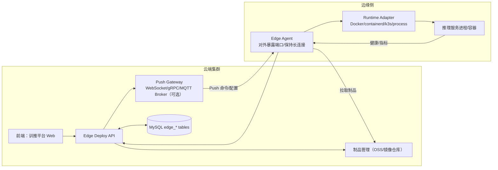
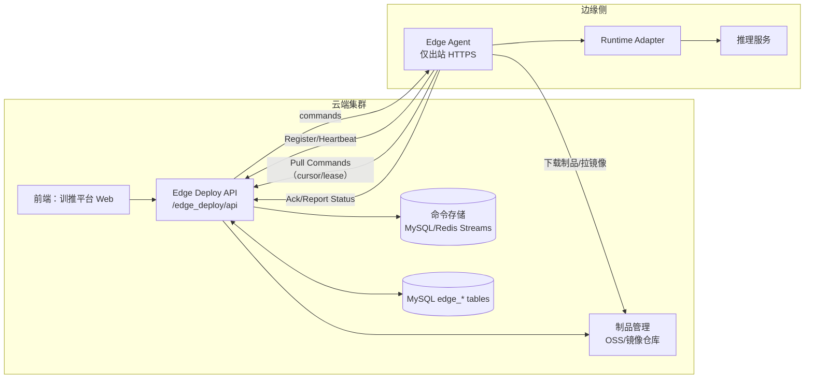
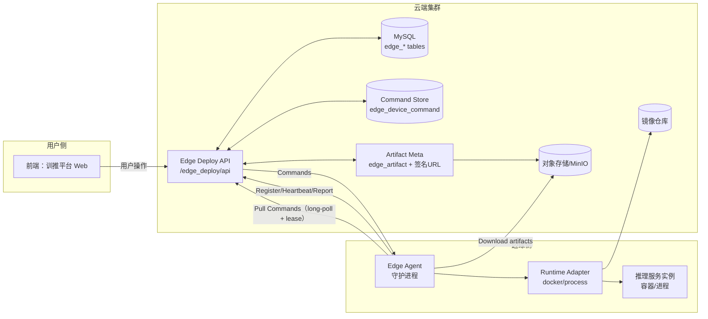
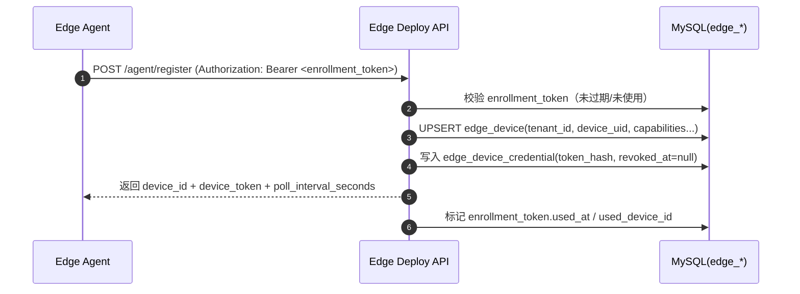
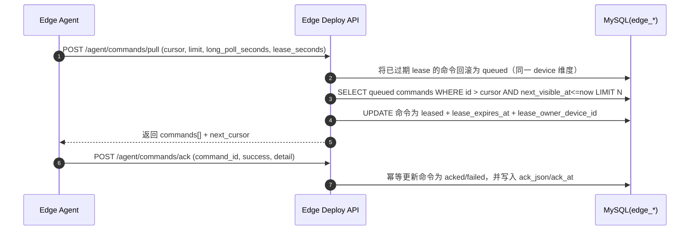
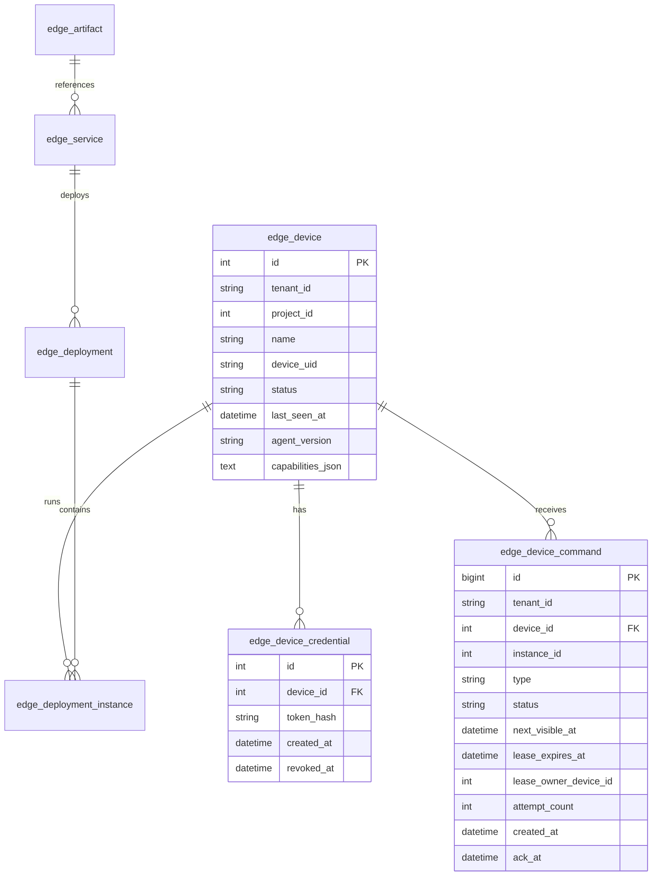

# 训推平台：边缘端部署（Edge Deploy）- 设计与预研

## 背景与目标

### 背景
- 现有“在线推理/服务部署”能力面向 **K8s 集群**（见 `myapp/views/view_serving.py` 的 `/service_modelview/api/*`），服务实例以 K8s Deployment/Service 形态运行。
- 现在需要支持 **边缘端部署**：部署对象可能是具身本体或边缘设备，网络环境可能存在 NAT/弱网/不稳定等特性。

### 业务目标（In Scope）
- 为用户提供“边缘部署”的服务管理能力：**边缘设备发现/连接**、**docker镜像/模型权重下发**、**边缘服务启动/停止/重启**、**边缘服务状态同步与健康检查**、**部署结果与历史可追溯**。
- 完成本次新增所有接口的单元测试用例，并对新增功能进行端到端测试，确保用例成功。

### Out of Scope（本期不做）
- 设备侧运行程序的具体实现（例如 Docker/containerd/k3s 的实际控制逻辑、具身本体内部通信协议）。
- 边缘端模型编译/量化流水线（可作为后续“制品生成/打包”扩展）。
- 多租户之间的跨租户设备共享与转移（本期按 tenant_id 隔离）。
- 复杂灰度发布策略（按设备分批发布/金丝雀发布）与多版本流量治理（可后续扩展）。

## 现状分析（在线推理/K8s）

### 现有后端形态
- API 入口：`/service_modelview/api/*`（见 `myapp/views/view_serving.py`），统一响应结构 `{"status":0,"message":"success","result":...}`（见 `myapp/const/response.py`）。
- 核心表：`service`、`inferenceservice`（见 `myapp/models/model_serving.py`），以及 `model`/`model_version`、`labels` 等。
- 关键业务函数：`myapp/apis/service.py` 提供 `build_service/insert_model/refresh_service_status` 等被路由调用的“构造与校验”逻辑。

### K8s部署 和 边缘部署 差异
- 云端部署（K8s）优势：服务运行环境可控、平台能直接管理、集群网络稳定、平台能直接管理运行态。
- 边缘部署（Edge）问题：平台可能无法主动连接设备（NAT），需要设备“反向连接/轮询”；设备资源与运行环境类型更加异构。

## 方案选型

### 方案 A：平台“推送控制”（Push Control）
- 平台通过公网直连设备 Agent（HTTP/WebSocket）下发命令与模型权重/镜像。
- 优点：控制实时、部署反馈快。
- 缺点：对网络要求高；NAT 场景困难；安全面更复杂（设备必须暴露端口）。

#### 架构设计（方案 A）

核心思路：平台作为“控制主动方”，需要直接连到设备侧 Agent（设备侧对公网开放端口，或通过 VPN/专线/隧道提供可达性）。



技术栈选择（建议）：
- 控制通道：WebSocket（HTTP/1.1 友好）或 gRPC streaming（高效、强类型）；可选 MQTT（多设备大规模在线，Broker 承压更稳）。
- 鉴权：mTLS（推荐，设备证书）或 Bearer Token + TLS；配合 IP 白名单/VPN。
- 制品分发：对象存储签名 URL（权重/配置包）+ 镜像仓库（容器镜像）。
- 运行环境：Docker/containerd/k3s（容器化）优先；极简设备用 process 模式。

> 备注（关键决策）：方案 A 的成败主要取决于“平台是否能稳定直连设备”。若必须穿越 NAT/弱网，建议优先方案 B。

#### 核心优势（方案 A）
- 控制实时性强：稳定网络与长连接条件下可做到亚秒级下发与回执。
- 控制通道更丰富：支持 push 式事件、持续 streaming（适合“实时交互/调试/日志 tail”类能力）。
- 设备侧实现相对简单：不需要轮询与命令队列语义（但依赖网络可达性）。

#### 适用场景（方案 A）
- 园区/工厂内网、专线/VPN、设备可被平台直连的场景
- 对“控制实时性”要求极高：需要秒级下发、快速止损/停机
- 设备规模中等、网络与安全域可统一管理（例如同一企业网络边界内）

#### 限制条件与适用边界（方案 A）
- 网络前置条件苛刻：需要平台稳定直连设备（公网可达/VPN/专线/隧道），NAT/弱网场景容易失败。
- 安全面更复杂：设备暴露端口或建立隧道，攻击面与安全域治理难度更高。
- 运维成本高：需要维护大量长连接、连接状态、心跳与断线重连；对网关/代理质量要求高。

#### 部署复杂度（方案 A）
- 平台侧：高（PushGW/连接管理/设备入站网络治理/证书与安全策略）。
- 设备侧：中（需要 Agent 与网络隧道/端口策略配合）。
- 运维复杂度：高（公网可达性、证书轮换、连接抖动与限流治理）。

#### 扩展性（方案 A）
- 更适合“实时控制”扩展：例如远程交互式调试、实时日志流、实时事件订阅。
- 设备规模上限受长连接与网关承压限制：需要更强的连接治理与水平扩展能力（Broker/网关集群）。

### 方案 B：设备“拉取控制”（Pull Control｜使用该方案）
- 设备 Agent 主动注册并周期性拉取命令（长轮询/短轮询），同时上报心跳与运行态；模型权重/镜像通过对象存储/镜像仓库下载。
- 优点：适配 NAT/弱网；平台侧实现更简单；可通过 token/mTLS 统一鉴权。
- 缺点：控制存在轮询延迟；需要命令队列与幂等处理。

#### 架构设计（方案 B）

核心思路：设备侧只需要“出站访问”（HTTPS），平台不需要直连设备；云端集群通过“命令队列 + 拉取协议”实现。



实现落地建议（云端集群）：
- 命令存储：先用 MySQL（edge_device_command）落地；规模上来后可演进为 Redis Streams / NATS JetStream（降低 DB 热点、提升拉取吞吐）。
- 拉取协议：
  - 短轮询：固定 poll_interval_seconds（例如 3–10s）。
  - 长轮询：服务端挂起请求到 timeout（例如 20–30s），有命令立即返回；减少空轮询。
  - lease 机制：命令出队后给“租约”，超时未 ack 自动回滚为 queued（避免设备掉线丢命令）。
- 幂等：command_id + type + payload_hash 做幂等键；Ack 重放不产生副作用。

> 备注（关键决策）：优先保证“命令与状态更新的幂等性”，这是边缘弱网下可运维的前提。

#### 核心优势（方案 B）
- NAT/弱网友好：设备只需出站访问，不要求公网可达。
- 安全面更可控：无需设备暴露端口；平台侧统一做鉴权、限流与审计。
- 实现更稳健：设备离线/断连不会影响平台整体；命令可重试、可追溯。
- 易于规模化：大量设备并发只体现为 API/QPS 与队列吞吐，更容易横向扩展。

#### 限制条件与适用边界（方案 B）
- 控制时延不可避免：轮询间隔决定“最坏下发延迟”（例如 5s 轮询，则最坏 ~5s + 网络时延）。
- 设备侧 Agent 是必选组件：需要在设备上常驻进程，负责拉取、执行、回执与运行环境适配。
- 大制品分发受网络影响：权重包/镜像较大时，下载耗时与失败率需要通过断点续传、校验与重试治理。
- 状态一致性是“最终一致”：平台侧状态以设备回报为准，需明确 UI 的状态语义（pending/running/unknown）。

#### 部署复杂度（方案 B）
- 平台侧：中等（新增 edge_* 表、命令队列、设备鉴权、限流与审计；可水平扩展）
- 设备侧：中等偏高（Agent 生命周期管理、运行程序适配、日志与自动更新）
- 运维复杂度：低于方案 A（不需要管理设备入站网络与长连接网关的公网可达性）

#### 扩展性（方案 B）
- 灰度/批次：命令按设备分批入队即可（all_at_once、batch、canary）。
- 多版本与回滚：以 artifact/image tag 为版本锚点，实例维度记录 current_version，支持一键回滚。
- 更丰富的控制类型：扩展 command.type（download/start/stop/restart/collect_logs/upgrade_agent）。
- 观测体系：实例维度汇聚日志/指标（Prometheus/OpenTelemetry），平台可做告警与 SLA。
- 安全升级：从 Bearer Token 平滑升级到 mTLS；支持 token 轮换与吊销。

**选择：方案 B（Pull Control）**
- 主要原因：边缘设备网络不稳定且常处于不可直连状态；拉取控制更易落地。

## 方案对比（A vs B）

> 备注：两种方案对“推理性能”的影响间接（主要由模型后端与硬件决定），差异主要体现在“云端集群实时性、网络可达性、安全与运维复杂度”。

| 维度 | 方案 A：Push Control | 方案 B：Pull Control（推荐） | 具体分析/备注 |
|---|---|---|---|
| 性能表现（推理） | 基本一致 | 基本一致 | 推理延迟/吞吐取决于 ORT/TensorRT/OpenVINO 与硬件；与控制通道关系不大 |
| 性能表现（云端集群时延） | 通常 < 1s（稳定网络+长连接） | 最坏≈轮询间隔（如 5–10s） | B 可用长轮询将“平均时延”降到 < 1s，但最坏仍受 timeout/网络影响 |
| 开发成本 | 中-高 | 中 | A 需要 PushGW/长连接管理、设备入站可达性与更复杂的安全策略 |
| 维护成本 | 高 | 中-低 | A 运维需要处理公网暴露/证书/连接稳定性；B 更多是队列与幂等治理 |
| 硬件兼容性 | 中 | 高 | A 对网络/网关条件敏感；B 只要能出站 HTTPS 即可 |
| 安全性 | 中（更依赖网络边界） | 高（更容易做最小暴露面） | A 设备需要入站端口或隧道；B 设备不暴露端口，审计点集中在平台 |
| 可扩展性（设备规模） | 中（长连接与网关承压） | 高（QPS/队列可水平扩展） | B 更适合海量设备；CmdStore 可演进为消息系统 |
| 弱网/离线容忍 | 低-中 | 高 | B 命令可重试、可追溯；A 在弱网下连接抖动影响更大 |
| 交付落地难度 | 高（依赖网络条件） | 中（依赖 Agent 能力） | A 的“前置条件”更苛刻；B 更符合边缘常态 |

## 第三方 Python 包推荐（边缘部署）

本节以“云端集群（控制面）/边缘侧（Agent）”视角给出两种方案可能用到的成熟 Python 包建议；标注【必选】表示 P0 落地建议引入，【可选】表示后续增强或按场景启用。

### 方案 A（Push Control）推荐包

| 包 | 必选/可选 | 使用侧 | 核心功能 | 性能表现 | 社区活跃度 | 兼容性与备注 |
|---|---|---|---|---|---|---|
| grpcio | 可选 | 平台/Agent | 双向 streaming RPC（push 控制通道） | 高（吞吐高、开销低） | 高 | 适合需要强类型与高吞吐；对网关/中间件要求更高 |
| websockets | 可选 | 平台/Agent | WebSocket 客户端/服务端 | 中-高（足够支撑多数控制面） | 中-高 | HTTP 友好，适合“设备保持长连接 + 平台推送命令”的实现 |
| paho-mqtt | 可选 | 平台/Agent | MQTT 客户端 | 中（取决于 Broker） | 高 | 适合“大规模设备在线 + Broker 承压”场景；需要引入 Broker 运维 |
| cryptography | 可选 | 平台/Agent | 证书/签名/加解密 | 高（底层实现成熟） | 高 | mTLS/证书轮换、签名校验等安全能力基础 |
| prometheus-client | 可选 | 平台/Agent | 指标暴露与采集 | 高（轻量） | 高 | 连接数、推送延迟、失败率等观测指标 |

### 方案 B（Pull Control）推荐包（本期方案）

| 包 | 必选/可选 | 使用侧 | 核心功能 | 性能表现 | 社区活跃度 | 兼容性与备注 |
|---|---|---|---|---|---|---|
| requests | 必选 | Agent | HTTPS 客户端（poll/long-poll） | 中-高（稳定、易用） | 高 | 适合短轮询/长轮询拉取命令与回执上报 |
| psutil | 必选 | Agent | 采集系统指标（CPU/内存/磁盘/进程） | 中（开销可控） | 高 | 用于心跳/设备状态上报；跨平台适配好 |
| docker | 可选 | Agent | Docker 容器生命周期控制 | 中（够用；受 Docker 环境影响） | 高 | 仅在 runtime_type=docker 时需要；process 模式可不引入 |
| tenacity | 可选 | Agent | 重试与退避策略 | 中-高（减少无效重试） | 中-高 | 弱网/断连重试治理；避免手写重试逻辑 |
| prometheus-client | 可选 | 平台/Agent | 指标暴露与采集 | 高（轻量） | 高 | 命令拉取延迟、租约超时次数、命令成功率等 |
| opentelemetry-sdk | 可选 | 平台/Agent | 链路追踪/指标/日志标准化 | 中（需采样治理） | 高 | 排障增强（需采样策略与上报后端） |
| cryptography | 可选 | 平台/Agent | 证书/签名/加解密 | 高（底层实现成熟） | 高 | 从 Bearer Token 平滑升级到 mTLS 的基础能力 |

方案 B：拉取命令（示例）：
```python
import time
import requests

BASE = "https://control-plane.example.com/edge_deploy/api"
TOKEN = "device_token"
device_id = 1
cursor = 0

while True:
  r = requests.post(
    f"{BASE}/agent/commands/pull",
    headers={"Authorization": f"Bearer {TOKEN}"},
    json={"device_id": device_id, "cursor": cursor, "limit": 10, "long_poll_seconds": 25, "lease_seconds": 30},
    timeout=35,
  )
  data = r.json()["result"]
  cursor = data["cursor"]
  for cmd in data["commands"]:
    requests.post(
      f"{BASE}/agent/commands/ack",
      headers={"Authorization": f"Bearer {TOKEN}"},
      json={"command_id": cmd["id"], "success": True, "detail": {}},
      timeout=10,
    )
  time.sleep(1)
```

## 目标架构

本章节以 **方案 B（Pull Control）** 为唯一目标架构：设备侧 Agent 仅出站 HTTPS 访问云端集群；云端通过“命令队列 + 租约（lease）+ 幂等 Ack”实现可追溯、可重试、弱网友好的边缘部署控制面。

### 设计目标与约束

- 网络约束：设备侧不可被直连（NAT/弱网），仅允许出站 HTTPS。
- 一致性：平台状态以设备回报为准，整体为最终一致；控制面必须支持断线重试与幂等。
- 可运维：命令全链路可追溯（谁下发、何时下发、设备何时取走、执行结果）。
- 安全：设备侧不暴露端口；设备 token 仅保存 hash，支持吊销与轮换；后续可平滑升级到 mTLS。
- 可扩展：先以 MySQL 实现命令存储/租约，规模上来后可替换为专用队列（协议不变）。

### 组件职责（Control Plane vs Edge Side）

#### 云端集群（Control Plane）

- Edge Deploy API：面向用户与设备 Agent 的统一入口（按 `tenant_id` 隔离）。
- Registry：一次性 Enrollment Token 的生成/核销；设备注册、发放 Device Token；token 吊销与轮换。
- MetaDB（MySQL）：存储 edge_* 元数据（设备/服务/部署/实例/命令）。
- Artifact：制品元数据（URI、digest、size）与“下载定位”（签名 URL）能力。
- Command Store：命令队列（初期用 `edge_device_command`），支持租约、超时回滚、重试计数。

#### 边缘侧（Edge Side）

Edge Agent 是需要开发与交付的组件：部署到边缘端设备上，与云端集群交互并驱动本地运行程序（Docker/process）完成下载、启动、停止、重启、状态上报等动作。

### 组件图（Mermaid）



### 核心协议与数据流（Plan B：租约 + 幂等 Ack）

#### 关键术语

- cursor：设备侧“已看过的最大 command_id”，用于增量拉取（幂等）。
- lease：命令被某设备取走后在一段时间内“占用”，避免多设备重复消费；超时后回滚可重试。
- idempotency：Ack 可重放；同一个 command_id 重复 Ack 不产生副作用。

#### 注册与发 token



#### 命令拉取（长轮询 + 租约）



### Edge Agent 设计（需要开发与交付）

#### 运行形态（推荐）

- 单进程守护：一个 Agent 进程负责注册、心跳、拉取命令、执行命令、上报实例状态。
- 运行环境适配：Agent 内置 Runtime Adapter 抽象，P0 支持 `docker` 与 `process` 两种。

#### 模块拆分（逻辑层面）

- Identity：Enrollment 注册、Device Token 管理（本地安全存储/轮换）。
- Poller：长轮询拉取命令（cursor、lease、退避重试、限速）。
- Executor：按 command.type 分发到具体执行器（download/start/stop/restart/...）。
- Runtime Adapter：封装容器/进程的生命周期控制、日志采集、健康检查。
- Artifact Manager：制品下载（签名 URL）、校验 digest、落盘与缓存。
- Reporter：心跳、设备状态、实例状态与命令 Ack 上报。
- Observability：本地日志（结构化）、基础指标（拉取延迟、命令成功率、执行耗时）。

#### P0 功能清单（必须落地）

- 注册：使用 Enrollment Token 注册设备并换取 Device Token。
- 心跳：定期上报 `online/offline`、基础系统信息（CPU/内存/磁盘）与 Agent 版本。
- 拉取命令：长轮询 + lease；支持断线重连与指数退避；cursor 持久化。
- 执行命令：
  - download_artifact：通过签名 URL 下载并校验 sha256（如提供）。
  - start_service：docker pull + run（或 process 启动），支持 env/ports/resources 的最小子集。
  - stop_service / restart_service：停止或重启实例。
- Ack：对每个命令上报 success/fail 与 detail（可包含错误码、stderr 摘要）。
- 上报实例状态：running/failed/stopped + endpoint（若可获取）+ last_error。

#### P1 功能清单（可后续迭代）

- 日志采集与回传（按需拉取/采样），避免大流量常态上传。
- Agent 自升级（云端下发 upgrade_agent 命令，拉取新包并热切换）。
- mTLS：用设备证书替代 bearer token，并支持证书轮换。
- 离线缓存：断网时缓存 Ack/状态，恢复后补报（幂等）。

#### 安装与部署到边缘端（建议给出两种交付形态）

**形态 A：Docker 容器（推荐 P0，最易交付）**

- 适用：设备已有 Docker（或兼容 runtime），允许以容器方式运行 Agent。
- 交付：提供 `edge-agent` 镜像。
- 运行：注入 enrollment token 或已签发 device token（仅首次注册需要 enrollment）。
- 挂载：挂载 `/var/lib/edge-agent` 持久化 cursor、token 与下载缓存。

**形态 B：二进制 + systemd（适用于不方便用 Docker 的设备）**

- 适用：极简设备或对容器运行环境不稳定的场景。
- 交付：提供 Linux amd64/arm64 二进制（或 Python 打包产物）。
- systemd：提供 `edge-agent.service`，开机自启；配置文件放置在 `/etc/edge-agent/config.yaml`；运行目录 `/var/lib/edge-agent`。

> 配置项（两种形态通用，建议）：`control_plane_base_url`、`enrollment_token`（一次性）、`device_token`（注册后保存）、`poll_interval_seconds`、`long_poll_seconds`、`lease_seconds`、`runtime_type`、`artifact_cache_dir`、`log_level`、`tags`。

### 数据库设计（与原有 serving 表解耦）

#### 设计原则（补充）

- 命令队列必须支持：租约、超时回滚、重试计数、可见时间（next_visible_at）与幂等 Ack。
- 设备状态与实例状态分离：设备在线离线由 heartbeat 决定；实例状态由 report_instance_status 决定。
- 避免跨租户：所有查询/更新以 `tenant_id` 为第一过滤条件；device token 与 tenant 绑定。

#### 迁移策略（新增/变更/回滚）

- 新增：本期只新增 `edge_*` 表（见 `schema.sql`），不修改现有 serving 表。
- 变更：若后续需要扩展字段，优先新增列并保持默认值，避免影响已在线设备。
- 回滚：按表级别回滚（删除新增表/索引），不影响现有 serving 功能；device/command 状态以最终一致为准。

#### ER（Mermaid）



#### 状态枚举（建议约定）

- device.status：`online|offline|unknown`
- command.status：`queued|leased|acked|failed|cancelled`
- instance.status：`pending|downloading|starting|running|stopped|failed|unknown`

#### 表结构（落地 SQL 见 `schema.sql`）

- `edge_device`：设备主表（tenant 隔离），补充 agent 版本与运行环境信息。
- `edge_device_credential`：device_token（仅存 hash，可吊销/轮换）。
- `edge_device_enrollment_token`：一次性接入令牌（过期与核销）。
- `edge_device_command`：命令队列（租约/可见时间/重试计数/ack 结果）。
- `edge_service`：服务模板（可选关联 model_id/model_version_id）。
- `edge_deployment`：一次部署记录（可选 desired_version，支持汇总 summary_json）。
- 其他表：`edge_artifact`、`edge_deployment_instance` 与本章 API/流程一致。

> 字段中文说明：建议在 `schema.sql` 中为每个字段补齐 MySQL `COMMENT`（字段作用与约束），用于后续落地与运维排障时快速对齐语义。

### API 设计（后端）

#### 设计约定（补充）

- BasePath：`/edge_deploy/api`
- 响应：统一 `{"status":0,"message":"success","result":...}`。
- 用户侧鉴权：复用现有 session（`g.user`）。
- 设备侧鉴权：`Authorization: Bearer <device_token>`；register 使用 enrollment token。
- 幂等：
  - 用户侧创建类接口建议支持 `Idempotency-Key`（可选，后续增强）。
  - 设备侧 Ack/Report 必须可重放（按主键更新、忽略重复）。
- 限流：设备侧接口按 device_id 或 token 维度限流（防止异常设备打爆）。

#### 路径/方法/权限（建议）

| 接口 | 方法 | 调用方 | 权限建议 |
|---|---|---|---|
| /devices, /devices/{id} | GET | 用户 | 登录用户；仅可访问本 tenant 数据 |
| /devices/enrollment_tokens | POST | 用户 | 建议管理员/项目管理员（用于发放接入令牌） |
| /services* | GET/POST | 用户 | 登录用户；写操作建议项目管理员 |
| /deployments* | GET/POST | 用户 | 登录用户；写操作建议项目管理员 |
| /agent/register | POST | 设备 | enrollment_token 鉴权（一次性/可过期/可核销） |
| /agent/heartbeat, /agent/commands/*, /agent/report_instance_status | POST | 设备 | device_token 鉴权（绑定 tenant_id + device_id） |

#### 错误码与异常场景（建议约定）

- 错误码：优先复用通用错误码（`myapp/const/error.py` 的 `CommonErrorCode`），保持平台全局一致的 `status/message/result` 结构。
- 常见异常与建议返回：
  - 参数校验失败（缺必填/非法枚举/分页参数错误）：`status=2`（INVALID_INPUT_PARAM）
  - 资源不存在（device/service/deployment/instance/artifact 不存在或不属于租户）：`status=404`（NOT_FOUND）
  - 权限不足/越权（token 与 device_id 不匹配、跨租户访问）：`status=4`（NOT_ALLOWED）
  - 内部错误（DB 异常、签名 URL 生成失败等）：`status=3`（INTERNAL_ERROR）
  - 系统繁忙/限流触发：`status=5`（BUSY）
  - 重放/幂等：Ack/Report 重复请求应返回成功（`status=0`），不得产生副作用。

#### 用户侧 API（前端调用）

**设备**

- `GET /devices`
  - query：`page,page_size,status,keyword,project_id`
  - result：`{ "items":[...], "page":0, "page_size":10, "total": 123 }`

`GET /devices` 响应示例（成功）：
```json
{
  "status": 0,
  "message": "success",
  "result": {
    "items": [
      {
        "id": 1,
        "name": "robot-01",
        "device_uid": "sn-xxx",
        "status": "online",
        "last_seen_at": "2026-01-16T12:00:00Z"
      }
    ],
    "page": 0,
    "page_size": 10,
    "total": 1
  }
}
```

`GET /devices` 响应示例（参数错误）：
```json
{
  "status": 2,
  "message": "INVALID_INPUT_PARAM",
  "result": { "detail": "page_size must be between 1 and 100" }
}
```
- `GET /devices/{device_id}`
  - result：设备详情 + 最近实例（可分页）。
- `POST /devices/enrollment_tokens`
  - body：`{ "project_id": 1, "expires_in_seconds": 3600, "note": "lab-robot" }`
  - result：`{ "token":"***", "expires_at":"2026-01-16T12:00:00Z" }`

**服务模板**

- `POST /services`
  - body：`{ "name":"svc-a","describe":"","project_id":1,"runtime_type":"docker","image":"repo/img:tag","command":"python app.py","working_dir":"/app","envs":{...},"ports":[...],"resources":{...},"artifact_id":123 }`
  - result：`{ "id": 1 }`
- `POST /services/list`
- `GET /services/{service_id}`
- `POST /services/{service_id}/update`

**部署**

- `POST /deployments`
  - body：`{ "service_id": 1, "device_ids":[1,2,3], "strategy":"all_at_once" }`
  - result：`{ "id": 101 }`
- `POST /deployments/list`
- `GET /deployments/{deployment_id}`
  - result：`deployment + instances[] + summary`
- `POST /deployments/{deployment_id}/actions`
  - body：`{ "action":"start|stop|restart|redeploy", "device_ids":[...] }`
  - 说明：actions 通过入队 command 实现（不直接触达设备）。

#### 设备侧 API（Edge Agent 调用）

**注册**

- `POST /agent/register`
  - headers：`Authorization: Bearer <enrollment_token>`
  - body：`{ "device_uid":"sn-xxx", "name":"robot-01", "capabilities":{...}, "agent_version":"0.1.0", "runtime_type":"docker" }`
  - result：`{ "device_id": 1, "device_token":"***", "poll_interval_seconds": 5, "long_poll_seconds": 25, "lease_seconds": 30 }`

**心跳**

- `POST /agent/heartbeat`
  - headers：`Authorization: Bearer <device_token>`
  - body：`{ "device_id":1, "status":"online", "ip":"", "metrics":{...}, "tags":{...} }`
  - 说明：服务端以接收时间计算离线阈值；device_id 与 token 必须匹配。

**拉取命令**

- `POST /agent/commands/pull`
  - headers：`Authorization: Bearer <device_token>`
  - body：`{ "device_id":1, "cursor": 123, "limit": 10, "long_poll_seconds": 25, "lease_seconds": 30 }`
  - result：`{ "cursor": 456, "server_time":"2026-01-16T12:00:00Z", "commands":[ { "id": 124, "instance_id": 1001, "type":"download_artifact", "payload":{...} } ] }`
  - 说明：
    - 服务端返回的 cursor 是本次返回命令中的最大 id（即使 commands 为空，也可以返回原 cursor）。
    - 若 `long_poll_seconds>0`，服务端可挂起等待命令或超时返回空列表（减少空轮询）。

`POST /agent/commands/pull` 响应示例（成功）：
```json
{
  "status": 0,
  "message": "success",
  "result": {
    "cursor": 456,
    "server_time": "2026-01-16T12:00:00Z",
    "commands": [
      { "id": 124, "instance_id": 1001, "type": "download_artifact", "payload": { "artifact_id": 123 } }
    ]
  }
}
```

**Ack**

- `POST /agent/commands/ack`
  - headers：`Authorization: Bearer <device_token>`
  - body：`{ "command_id":1, "success":true, "detail":{...} }`
  - 说明：重复 Ack 必须返回 success（幂等）；若 command 不属于该 device/tenant 返回错误。

**上报实例状态**

- `POST /agent/report_instance_status`
  - headers：`Authorization: Bearer <device_token>`
  - body：`{ "instance_id": 1001, "status":"pending|downloading|starting|running|stopped|failed|unknown", "endpoint":{...}, "detail":{...}, "error_msg":"" }`

**制品下载定位（可选）**

- `GET /agent/artifacts/{artifact_id}/download_url`
  - headers：`Authorization: Bearer <device_token>`
  - result：`{ "url":"https://...signed...", "expires_at":"..." }`

## 任务拆解（按模块/文件可落地）

- DB
  - 迁移与初始化：对应 [schema.sql](file:///Users/caiyueliang/project/wzy/taichu-studio/docs/技术文档/20260116-边缘部署/schema.sql) 的 `edge_*` 表；落地到 `myapp/migrations/versions/*`。
- 模型层（SQLAlchemy）
  - `myapp/models/model_edge_deploy.py`：edge_device、edge_service、edge_deployment、edge_device_command 等模型与枚举约束。
- API 层（Flask-AppBuilder）
  - `myapp/apis/edge_deploy.py`：`route_base='/edge_deploy/api'`，在模块内通过 `appbuilder.add_api(...)` 注册接口；应用启动时由 `myapp/app.py` 导入 `myapp/apis` 触发注册。
- API
  - `myapp/apis/edge_deploy.py`：命令入队、租约回滚、幂等 Ack、设备在线离线计算、实例状态聚合。
- 测试
  - `myapp/tests/unit/edge_deploy/`：按 [testcases.md](file:///Users/caiyueliang/project/wzy/taichu-studio/docs/技术文档/20260116-边缘部署/testcases.md) 用例清单补齐单测/集成测试。


## 风险清单

- 命令重复消费：必须通过 lease + ack 幂等确保“最多一次生效”（在弱网下倾向 at-least-once 投递，依赖幂等实现等价 exactly-once）。
- 命令卡死：设备取走后长期不 Ack，需要 lease 超时回滚 + attempt_count 控制重试风暴。
- 制品大文件下载不稳定：P0 先做 digest 校验 + 重试；后续做断点续传与分片。
- token 泄露：必须只存 hash，支持吊销；Agent 本地 token 必须持久化且保护权限（文件权限/密钥环）。
- 设备时间不准：离线判定完全使用服务端接收时间，不依赖设备时间戳。

## 验证计划（预研阶段可验证，P0 必须通过）

- 注册链路：Enrollment → Register → 下发 Device Token → 后续请求均鉴权通过。
- 命令链路：入队 → Pull（lease）→ Ack（幂等重放）→ 命令状态正确流转。
- 部署链路：创建 service → 创建 deployment → 生成 per-device commands → Agent 执行 download/start → report_instance_status → UI 可观测到状态变化。
- 弱网链路：模拟超时/断连/重复请求，确保 cursor 与 ack 幂等不导致重复启动或状态错乱。

### 测试用例清单（摘要）

完整用例见 [testcases.md](file:///Users/caiyueliang/project/wzy/taichu-studio/docs/技术文档/20260116-边缘部署/testcases.md)，本节仅列出 P0/P1 覆盖点以满足“预研阶段验证可追溯”：

| 用例 ID | 覆盖点 | 优先级 |
|---|---|---|
| ED-REG-001/002/003 | 注册与 enrollment token 合规性与幂等 | P0/P1 |
| ED-HB-001/002 | 心跳在线状态、token 与 device_id 绑定防越权 | P0 |
| ED-CMD-001/002/003 | 拉取命令、长轮询、lease 过期回滚与重试 | P0/P1 |
| ED-ACK-001/002/003 | Ack 状态流转与幂等重放、非本设备拒绝 | P0 |
| ED-INS-001/002/003 | 实例状态上报与幂等、非法枚举校验 | P0 |
| ED-ART-001 | 制品下载 URL 获取（可选能力） | P1 |
| ED-USER-DEV-001 | 用户侧分页查询与租户隔离 | P0 |
| ED-USER-DEP-001 | 创建 deployment 生成 per-device commands（集成） | P0 |
