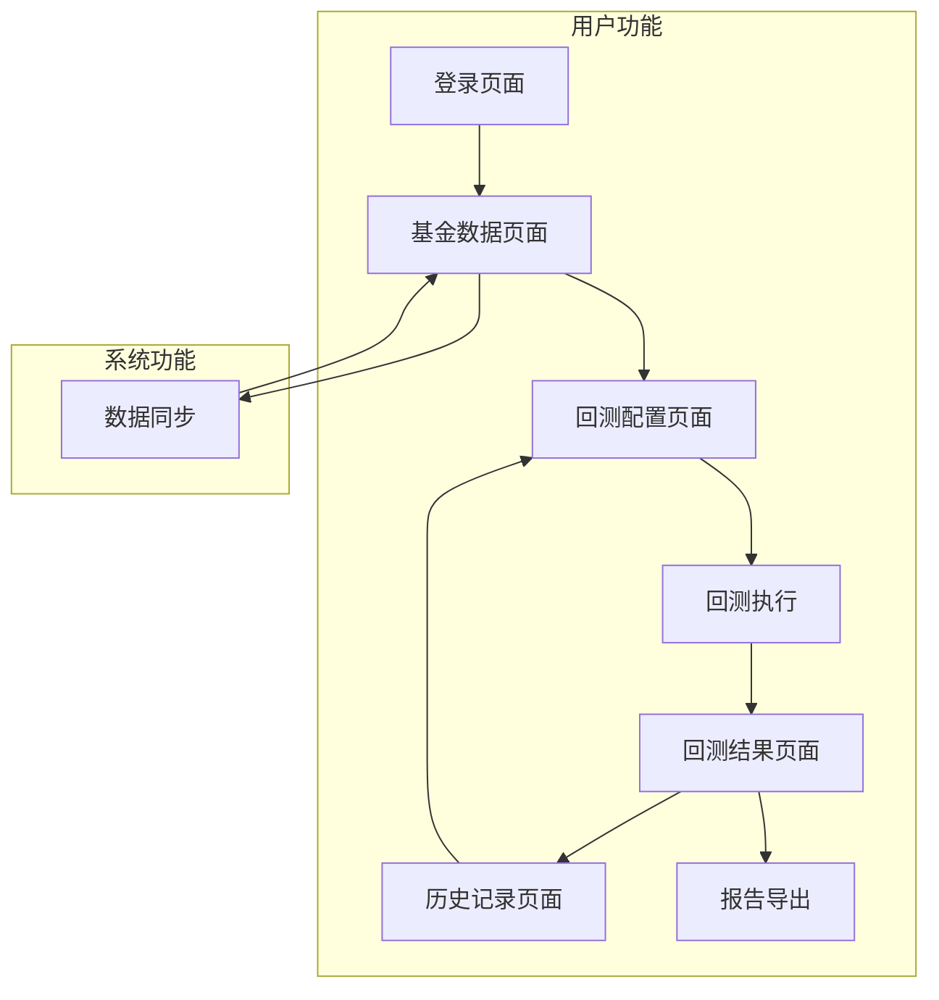

## 1. 产品概述
基金量化回测平台是一个专业的投资分析工具，帮助用户通过历史数据验证和优化量化交易策略。该平台主要服务于量化投资研究者和基金经理，通过提供基金数据管理、策略回测、结果可视化等功能，提升投资决策的科学性和准确性。

## 2. 核心功能

### 2.1 用户角色
| 角色 | 注册方式 | 核心权限 |
|------|----------|----------|
| 普通用户 | 邮箱注册 | 浏览基金数据、执行基础回测、查看个人回测历史 |
| 高级用户 | 管理员分配 | 创建复杂策略、批量回测、导出报告、管理基金数据 |
| 管理员 | 系统预设 | 用户管理、系统配置、数据同步管理、监控报警设置 |

### 2.2 功能模块
平台包含以下核心页面：
1. **登录页面**：用户认证、密码找回、注册入口
2. **基金数据页面**：基金列表展示、数据同步控制、基金详情查看
3. **回测配置页面**：策略参数设置、基金选择、回测时间范围配置
4. **回测结果页面**：收益曲线展示、交易信号图表、性能指标统计
5. **历史记录页面**：回测历史列表、结果对比、报告导出
6. **系统管理页面**：用户管理、数据源配置、系统监控

### 2.3 页面详情
| 页面名称 | 模块名称 | 功能描述 |
|----------|----------|----------|
| 登录页面 | 用户认证 | 输入用户名密码进行登录，支持记住登录状态 |
| 基金数据页面 | 基金列表 | 展示基金代码、名称、最新净值、更新时间等关键信息 |
| 基金数据页面 | 数据同步 | 提供手动同步按钮，支持选择同步最近N天数据 |
| 基金数据页面 | 自动同步 | 显示自动同步状态，可配置同步频率和时间 |
| 回测配置页面 | 策略设置 | 设置上涨触发比例、下跌触发比例、加倍投系数等参数 |
| 回测配置页面 | 基金选择 | 多选基金构建投资组合，设置各基金权重 |
| 回测配置页面 | 时间范围 | 选择回测起始日期和结束日期 |
| 回测结果页面 | 收益曲线 | 展示策略收益曲线，支持对比基准收益 |
| 回测结果页面 | 交易信号 | 在图表上标注买入卖出信号点 |
| 回测结果页面 | 性能指标 | 显示年化收益率、最大回撤、夏普比率等关键指标 |
| 历史记录页面 | 回测历史 | 列表展示历史回测记录，包含策略名称、运行时间、收益等 |
| 历史记录页面 | 结果对比 | 选择多个回测结果进行横向对比分析 |
| 历史记录页面 | 报告导出 | 生成并下载PDF格式的详细回测报告 |
| 系统管理页面 | 用户管理 | 管理员进行用户权限分配和账号管理 |
| 系统管理页面 | 系统监控 | 实时显示系统运行状态、数据同步状态、异常报警 |

## 3. 核心流程
用户操作流程：
1. 用户登录系统后进入基金数据页面，可查看当前基金数据状态
2. 在回测配置页面设置策略参数，选择目标基金和时间范围
3. 提交回测任务，系统后台执行Python策略代码
4. 回测完成后在结果页面查看可视化图表和性能指标
5. 可将结果保存到历史记录，或导出详细报告

管理员操作流程：
1. 配置数据同步任务，设置自动同步频率
2. 监控系统运行状态，处理异常报警
3. 管理用户权限，分配高级功能访问权限

## 4. 用户界面设计

### 4.1 设计风格
- **主色调**：深蓝色 (#1e3a8a) 作为主色，浅灰色 (#f8fafc) 作为背景色
- **按钮样式**：圆角矩形设计，主要操作为实心按钮，次要操作为边框按钮
- **字体**：中文使用思源黑体，英文使用Inter，正文字号14px，标题字号18-24px
- **布局风格**：左侧导航栏 + 右侧内容区的经典管理后台布局
- **图标风格**：使用简洁的线性图标，统一使用2px线条粗细

### 4.2 页面设计概览
| 页面名称 | 模块名称 | UI元素 |
|----------|----------|--------|
| 基金数据页面 | 数据表格 | 使用卡片式表格，每行显示基金关键信息，支持排序和筛选 |
| 回测配置页面 | 参数表单 | 分组展示策略参数，使用滑块和数字输入框，实时显示参数说明 |
| 回测结果页面 | 图表区域 | 全屏展示收益曲线图，支持缩放和交互，右侧显示关键指标卡片 |
| 历史记录页面 | 记录列表 | 时间轴形式展示历史记录，支持按时间和收益排序 |

### 4.3 响应式设计
采用桌面端优先的设计策略，主界面针对1920x1080分辨率优化。在平板和移动设备上，导航栏会折叠为汉堡菜单，表格会转为卡片式布局，图表会自动调整尺寸保持可读性。触摸交互优化包括更大的点击区域和滑动手势支持。

### 4.4 数据可视化
图表使用ECharts库，收益曲线采用面积图形式，基准对比使用虚线。交易信号使用不同颜色的标记点：绿色向上箭头表示买入，红色向下箭头表示卖出。性能指标卡片使用渐变背景和醒目的数字展示。