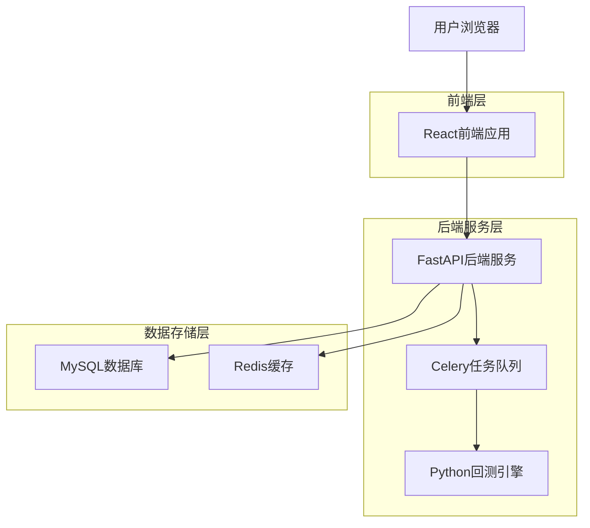
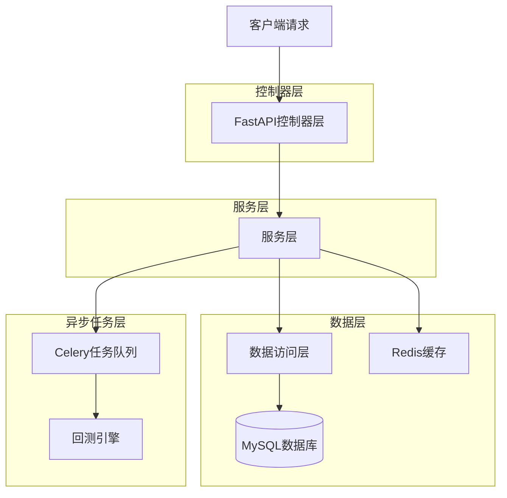
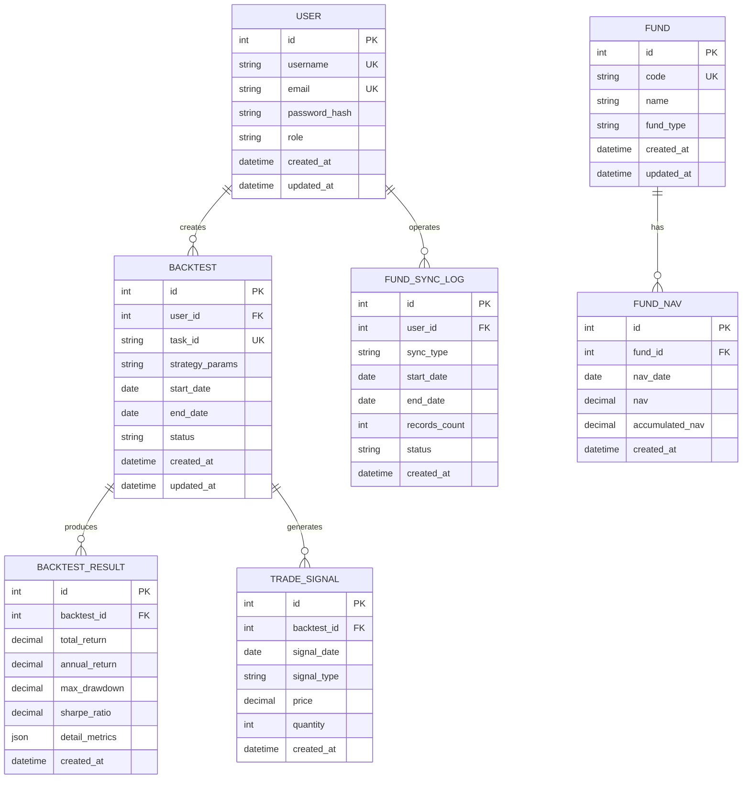

## 1. 架构设计



## 2. 技术描述

- **前端**: React@18 + TypeScript@5 + Ant Design@5 + ECharts@5
- **初始化工具**: vite-init
- **后端**: Python@3.11 + FastAPI@0.104 + SQLAlchemy@2.0 + Celery@5.3
- **数据库**: MySQL@8.0（主库）+ Redis@7.2（缓存）+ SQLite（本地开发）
- **任务队列**: Celery + Redis/RabbitMQ
- **容器化**: Docker + docker-compose

## 3. 路由定义

| 路由 | 用途 |
|------|------|
| / | 登录页面，用户认证入口 |
| /dashboard | 主控制台，系统概览 |
| /funds | 基金数据页面，展示基金列表和数据同步 |
| /backtest/config | 回测配置页面，设置策略参数 |
| /backtest/result/:id | 回测结果页面，展示回测详情 |
| /history | 历史记录页面，查看历史回测 |
| /admin/users | 用户管理页面，管理员功能 |
| /admin/monitor | 系统监控页面，实时状态监控 |

## 4. API定义

### 4.1 用户认证API

```
POST /api/auth/login
```

请求参数：
| 参数名 | 参数类型 | 是否必需 | 描述 |
|--------|----------|----------|------|
| username | string | 是 | 用户名 |
| password | string | 是 | 密码（明文） |

响应参数：
| 参数名 | 参数类型 | 描述 |
|--------|----------|------|
| access_token | string | JWT访问令牌 |
| token_type | string | 令牌类型 |
| expires_in | integer | 过期时间（秒） |

示例：
```json
{
  "username": "admin",
  "password": "123456"
}
```

### 4.2 基金数据API

```
GET /api/funds
```

查询参数：
| 参数名 | 参数类型 | 是否必需 | 描述 |
|--------|----------|----------|------|
| page | integer | 否 | 页码，默认1 |
| page_size | integer | 否 | 每页条数，默认20 |
| search | string | 否 | 搜索关键词 |

响应参数：
| 参数名 | 参数类型 | 描述 |
|--------|----------|------|
| total | integer | 总记录数 |
| items | array | 基金数据数组 |
| items[].code | string | 基金代码 |
| items[].name | string | 基金名称 |
| items[].nav | number | 最新净值 |
| items[].date | string | 净值日期 |

### 4.3 回测API

```
POST /api/backtest/run
```

请求参数：
| 参数名 | 参数类型 | 是否必需 | 描述 |
|--------|----------|----------|------|
| fund_codes | array | 是 | 基金代码数组 |
| start_date | string | 是 | 开始日期（YYYY-MM-DD） |
| end_date | string | 是 | 结束日期（YYYY-MM-DD） |
| strategy_params | object | 是 | 策略参数 |
| strategy_params.rise_ratio | number | 是 | 上涨触发比例 |
| strategy_params.fall_ratio | number | 是 | 下跌触发比例 |
| strategy_params.multiplier | number | 是 | 加倍投系数 |

响应参数：
| 参数名 | 参数类型 | 描述 |
|--------|----------|------|
| task_id | string | 回测任务ID |
| status | string | 任务状态 |

## 5. 服务器架构图



## 6. 数据模型

### 6.1 数据模型定义



### 6.2 数据定义语言

用户表（users）：
```sql
CREATE TABLE users (
    id INT PRIMARY KEY AUTO_INCREMENT,
    username VARCHAR(50) UNIQUE NOT NULL,
    email VARCHAR(100) UNIQUE NOT NULL,
    password_hash VARCHAR(255) NOT NULL,
    role ENUM('admin', 'premium', 'basic') DEFAULT 'basic',
    is_active BOOLEAN DEFAULT TRUE,
    created_at TIMESTAMP DEFAULT CURRENT_TIMESTAMP,
    updated_at TIMESTAMP DEFAULT CURRENT_TIMESTAMP ON UPDATE CURRENT_TIMESTAMP,
    INDEX idx_username (username),
    INDEX idx_email (email)
);
```

基金表（funds）：
```sql
CREATE TABLE funds (
    id INT PRIMARY KEY AUTO_INCREMENT,
    code VARCHAR(10) UNIQUE NOT NULL,
    name VARCHAR(100) NOT NULL,
    fund_type VARCHAR(20),
    created_at TIMESTAMP DEFAULT CURRENT_TIMESTAMP,
    updated_at TIMESTAMP DEFAULT CURRENT_TIMESTAMP ON UPDATE CURRENT_TIMESTAMP,
    INDEX idx_code (code),
    INDEX idx_name (name)
);
```

基金净值表（fund_navs）：
```sql
CREATE TABLE fund_navs (
    id INT PRIMARY KEY AUTO_INCREMENT,
    fund_id INT NOT NULL,
    nav_date DATE NOT NULL,
    nav DECIMAL(10,4) NOT NULL,
    accumulated_nav DECIMAL(10,4),
    created_at TIMESTAMP DEFAULT CURRENT_TIMESTAMP,
    UNIQUE KEY uk_fund_date (fund_id, nav_date),
    FOREIGN KEY (fund_id) REFERENCES funds(id) ON DELETE CASCADE,
    INDEX idx_nav_date (nav_date),
    INDEX idx_fund_id (fund_id)
);
```

回测任务表（backtests）：
```sql
CREATE TABLE backtests (
    id INT PRIMARY KEY AUTO_INCREMENT,
    user_id INT NOT NULL,
    task_id VARCHAR(36) UNIQUE NOT NULL,
    strategy_params JSON NOT NULL,
    start_date DATE NOT NULL,
    end_date DATE NOT NULL,
    fund_codes JSON NOT NULL,
    status ENUM('pending', 'running', 'completed', 'failed') DEFAULT 'pending',
    error_message TEXT,
    created_at TIMESTAMP DEFAULT CURRENT_TIMESTAMP,
    updated_at TIMESTAMP DEFAULT CURRENT_TIMESTAMP ON UPDATE CURRENT_TIMESTAMP,
    FOREIGN KEY (user_id) REFERENCES users(id) ON DELETE CASCADE,
    INDEX idx_user_id (user_id),
    INDEX idx_status (status),
    INDEX idx_created_at (created_at)
);
```

回测结果表（backtest_results）：
```sql
CREATE TABLE backtest_results (
    id INT PRIMARY KEY AUTO_INCREMENT,
    backtest_id INT UNIQUE NOT NULL,
    total_return DECIMAL(10,4),
    annual_return DECIMAL(10,4),
    max_drawdown DECIMAL(10,4),
    sharpe_ratio DECIMAL(10,4),
    win_rate DECIMAL(5,2),
    profit_factor DECIMAL(10,4),
    total_trades INT,
    detail_metrics JSON,
    created_at TIMESTAMP DEFAULT CURRENT_TIMESTAMP,
    FOREIGN KEY (backtest_id) REFERENCES backtests(id) ON DELETE CASCADE,
    INDEX idx_backtest_id (backtest_id)
);
```

交易信号表（trade_signals）：
```sql
CREATE TABLE trade_signals (
    id INT PRIMARY KEY AUTO_INCREMENT,
    backtest_id INT NOT NULL,
    signal_date DATE NOT NULL,
    fund_code VARCHAR(10) NOT NULL,
    signal_type ENUM('buy', 'sell') NOT NULL,
    price DECIMAL(10,4) NOT NULL,
    quantity INT NOT NULL,
    portfolio_value DECIMAL(15,2),
    created_at TIMESTAMP DEFAULT CURRENT_TIMESTAMP,
    FOREIGN KEY (backtest_id) REFERENCES backtests(id) ON DELETE CASCADE,
    INDEX idx_backtest_id (backtest_id),
    INDEX idx_signal_date (signal_date)
);
```

### 6.3 初始数据

```sql
-- 插入默认管理员用户（密码：admin123）
INSERT INTO users (username, email, password_hash, role) VALUES 
('admin', 'admin@example.com', '$2b$12$K.Ik8t.8mG7ZQHvH7K8yOeFyJmJzXzXzXzXzXzXzXzXz', 'admin');

-- 插入示例基金数据
INSERT INTO funds (code, name, fund_type) VALUES 
('000001', '华夏成长', '混合型'),
('000002', '华夏大盘精选', '混合型'),
('000003', '中海优质成长', '混合型'),
('000004', '华安宝利配置', '混合型'),
('000005', '嘉实成长收益', '混合型');
```